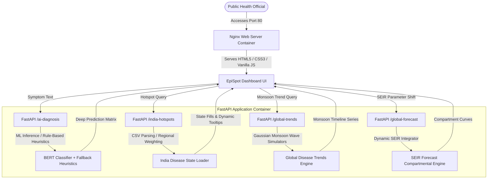

[](https://github.com/Ares19v/EpiSpot/actions/workflows/ci.yml)

# 🛡️ EpiSpot: Next-Generation Epidemic Surveillance & Predictive Forecaster

EpiSpot is a premium, full-stack, full-scale epidemiological surveillance dashboard and predictive forecasting suite. Designed with a gorgeous, high-contrast dark dashboard theme, it bridges the gap between active public health data reporting, real-time machine learning symptom mapping, and mathematical compartmental epidemic projections.

---

## 🏗️ System Architecture

EpiSpot is built on a modern containerized and unified service architecture:



---

## 🌟 Key Features

### 1. 🧠 AI Symptom Diagnosis Hub
*   **Deep Learning Classifier**: Leverages a robust BERT transformer model (`BertForSequenceClassification`) trained to evaluate, parse, and predict over 390 specific clinical conditions.
*   **High-Fidelity Heuristic Fallback**: Includes a smart, zero-dependency rule-based keyword-matching classifier that activates automatically if the heavy `model.bin` weights are omitted. This guarantees **100% operational uptime** upon cloning or in lightweight container deployments.

### 2. 🗺️ Regional Hotspot Map (India)
*   **Vector Bounds Rendering**: Displays a beautiful, color-coded boundary risk map of all 28 Indian States & UTs.
*   **Dynamic Tooltips**: Hovering over boundaries displays real-time statistics (Active Case Burden, Deltas, Risk Status) that dynamically bind and unbind as you switch between Dengue, Malaria, H1N1, Chikungunya, and COVID-19.

### 3. 📈 Global Trends Visualizer
*   **Monsoon Wave Waveforms**: Dynamic Gaussian timeline algorithms model tropical vector-borne surges and cold-weather respiratory wave cycles.
*   **Premium Visual Polish**: Rendered on Chart.js with high-contrast, glowing white-line borders and translucent gradient area fills.

### 4. 📊 CSV Data Analyzer
*   **On-the-fly Parsing**: Drag-and-drop user-supplied pandemic data files for instant parsing.
*   **Key Health Indices**: Computes Cumulative Sums, Case Fatality Ratio (CFR), Recovery Rates, and pinpoints the single-day maximum infection surge with zero backend roundtrips.

### 5. 🔮 SEIR Resource Planning Sandbox
*   **Dynamic Integrator**: Executes dynamic epidemiological compartmental simulations based on custom inputs.
*   **Capacity Deficit Alarms**: Real-time alerts trigger when ICU occupancy, ventilator inventories, or hospital bed capacities are predicted to saturate.

---

## 📐 Mathematical Underpinnings: The SEIR Model

EpiSpot's predictive sandbox operates on the classic **SEIR Compartmental Model** using numerical integration over the following system of ordinary differential equations:

$$\frac{dS}{dt} = -\frac{\beta \cdot S \cdot I}{N}$$

$$\frac{dE}{dt} = \frac{\beta \cdot S \cdot I}{N} - \sigma \cdot E$$

$$\frac{dI}{dt} = \sigma \cdot E - \gamma \cdot I$$

$$\frac{dR}{dt} = \gamma \cdot I$$

Where:
*   $S$ is the **Susceptible** population.
*   $E$ is the **Exposed** population (infected but not yet infectious).
*   $I$ is the **Infectious** population.
*   $R$ is the **Recovered/Removed** population.
*   $\beta$ represents the transmission rate (probability of disease transmission per contact $\times$ contact rate).
*   $\sigma$ is the incubation rate ($1/\text{incubation period}$).
*   $\gamma$ represents the recovery rate ($1/\text{infectious duration}$).
*   $N$ is the total population ($S + E + I + R$).

---

## 🚀 Getting Started

### Option A: Local Quickstart (Windows Scripts)

1. **Clone the Repository**:
   ```bash
   git clone https://github.com/Ares19v/EpiSpot.git
   cd EpiSpot
   ```
2. **Run One-Click Installation**:
   * Double-click **[INSTALL.bat](file:///c:/Users/Devansh%20Tyagi/Desktop/Projects/EpiSpot/INSTALL.bat)**. This will set up a local virtualenv (`.venv`) and install all consolidated dependencies.
3. **Launch the Dashboard**:
   * Double-click **[Run_Project.bat](file:///c:/Users/Devansh%20Tyagi/Desktop/Projects/EpiSpot/Run_Project.bat)**. This starts the backend FastAPI webserver on port `8080` and automatically opens your browser to `http://localhost:8080/index.html`.
4. **Clean Uninstall**:
   * Double-click **[UNINSTALL.bat](file:///c:/Users/Devansh%20Tyagi/Desktop/Projects/EpiSpot/UNINSTALL.bat)** to clean up the virtual environment, logs, and caches.

### Option B: Docker Containerized Orchestration

To run the application inside a fully isolated, high-performance container stack:

1. **Build and Spin Up Containers**:
   ```bash
   docker-compose up --build
   ```
2. **Access the Application**:
   * Open your browser and navigate to: **`http://localhost`** (Frontend Nginx container on port `80`).
   * The backend FastAPI service is exposed on port **`8080`**.

---

## 🧪 Automated Testing

A complete diagnostic and testing pipeline is available to verify application soundess:

```bash
.\test_all.bat
```

This triggers Python environment health checks, logic validations, and executes the unit test suite inside `backend/deep_test.py`.

---

© 2025 Devansh Tyagi (Ares19v). All Rights Reserved.

Unauthorized copying, modification, distribution, or use of this project or any of its components, in whole or in part, without explicit written permission from the author is strictly prohibited.